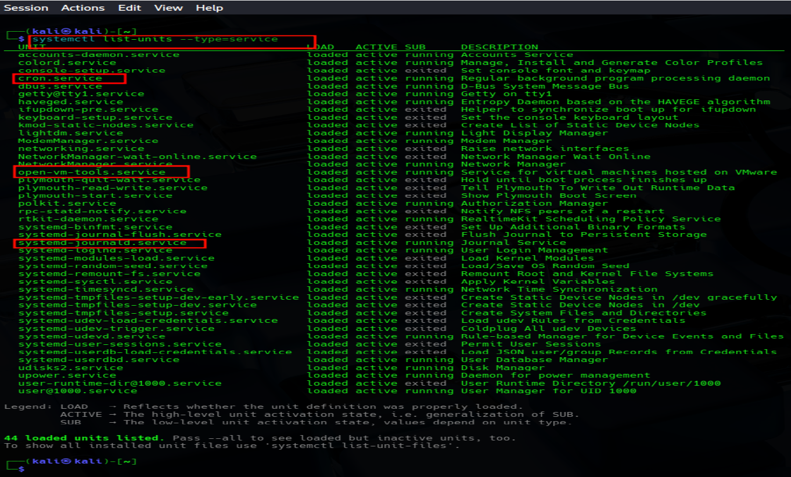
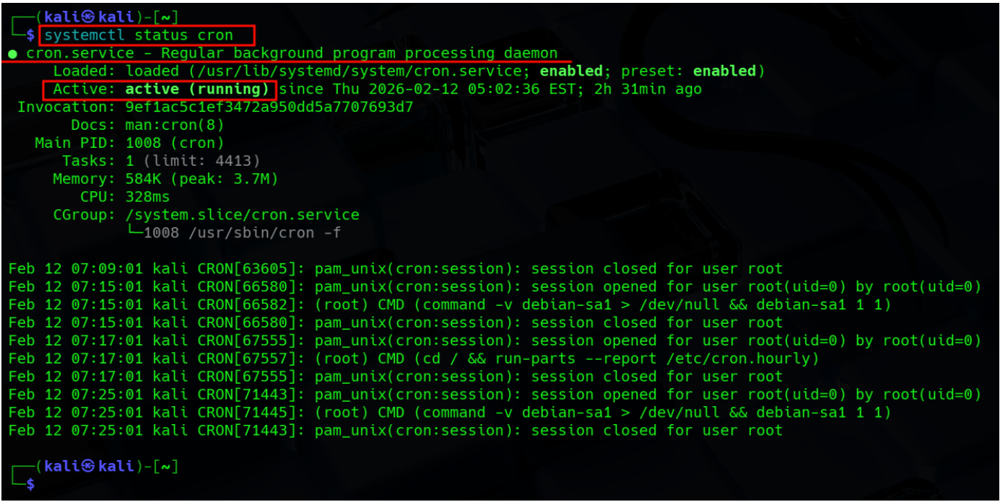
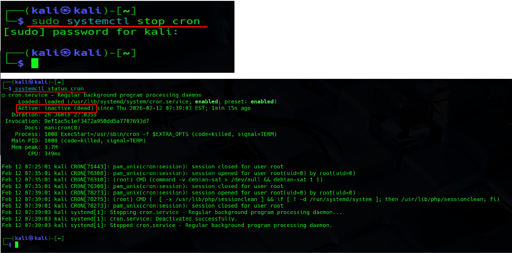
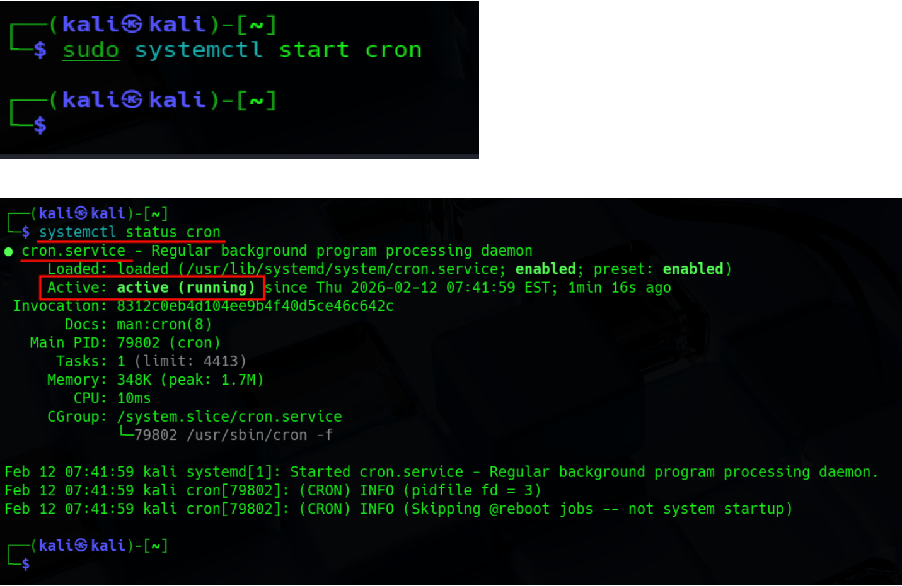

# Lab Report: Identification and Management of Running Services

**Student Name:** Suraj Somkuwar  
**System Environment:** Kali Linux (Virtual Machine)  
**Date:** February 12, 2026  

---

## 1. Objective
To identify active system services using command-line tools, select specific targets for analysis, and demonstrate the ability to safely stop and restart a service to verify process control.

---

## 2. Identified Active Services

Using the command `systemctl list-units --type=service`, the following three active services were identified from the system output:

| Service | Description | Status |
|---|---|---|
| `cron.service` | System job scheduler | active (running) |
| `systemd-journald.service` | System logging service | active (running) |
| `open-vm-tools.service` | VMware utility service for host-guest integration | active (running) |



---

## 3. Procedure Log & Observations

### Step 1: Status Check
- **Action:** Check the initial status of the target service (`cron`).
- **Command:**
```bash
systemctl status cron
```
- **Observation:** Service status confirmed as **active (running)**.



---

### Step 2: Service Termination
- **Action:** Stop the target service (`cron`).
- **Command:**
```bash
sudo systemctl stop cron
```
- **Observation:** The service stopped immediately. A subsequent status check confirmed the state changed to **inactive (dead)**.



---

### Step 3: Service Restoration
- **Action:** Restart the target service (`cron`).
- **Command:**
```bash
sudo systemctl start cron
```
- **Observation:** The service successfully restarted. Status check confirmed the state returned to **active (running)**.



---

## 4. Conclusion

The lab successfully demonstrated the ability to enumerate running services and control their state using the `systemctl` utility. The `cron` service was safely toggled off and on without error, verifying administrative privileges and proper service management syntax.
